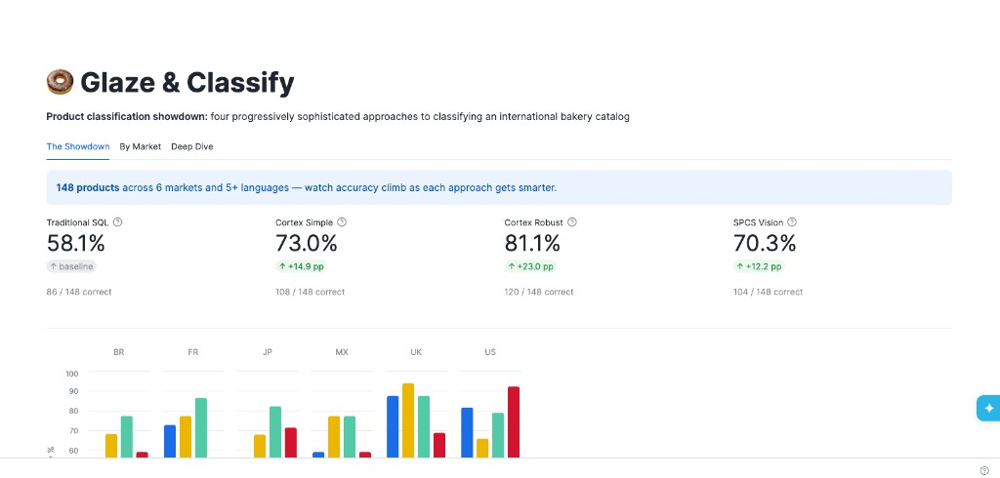
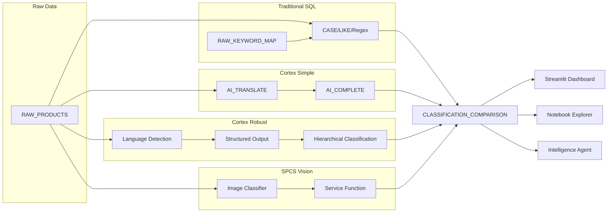

# Glaze & Classify

<!-- TODO: Replace with an actual screenshot of the Streamlit dashboard -->


Inspired by a real customer question: *"How do I translate and classify my international product catalog using only SQL?"*

This project answers that question four different ways — from brittle SQL keywords to Cortex AI pipelines to a custom vision model — and compares the results side by side.

**Author:** SE Community
**Last Updated:** 2026-03-24 | **Expires:** 2026-07-01 | **Status:** ACTIVE

> **No support provided.** This code is for reference only. Review, test, and modify before any production use.
> This demo expires on 2026-07-01. After expiration, validate against current Snowflake docs before use.

---

## The Problem

An international bakery sells 148 products across 6 markets in 5 languages. Every product needs to be classified into a consistent taxonomy of 8 categories and 24 subcategories — but the same donut has a different name in every market:

| Market | Product Name | Language | Gold Category |
|--------|-------------|----------|---------------|
| US | Original Glazed Donut | English | Glazed |
| JP | オリジナル グレーズド | Japanese | Glazed |
| FR | Donut Glacé Original | French | Glazed |
| MX | Dona Glaseada Original | Spanish | Glazed |
| BR | Donut Glaceado Original | Portuguese | Glazed |
| US | `IMG_4521.jpg` | *(none)* | Glazed |

The last row is the hardest case: some products arrive as nothing but a photograph. No name, no description, no language — just pixels.

How do you classify all of them?

---

## The Progression

### 1. Traditional SQL — the "before" state

The obvious first attempt: `CASE` expressions, `LIKE` patterns, regex, and a keyword lookup table. 100+ lines of SQL that only knows English.

```sql
FROM RAW_PRODUCTS p
INNER JOIN RAW_KEYWORD_MAP km
    ON LOWER(p.product_name) LIKE '%' || LOWER(km.keyword) || '%'
    AND km.language_code = 'en'   -- English only
```

It works for "Original Glazed Donut." It returns nothing for `オリジナル グレーズド`. And it can't even attempt `IMG_4521.jpg`.

> [!TIP]
> **Pattern demonstrated:** Keyword lookup with `QUALIFY ROW_NUMBER()` for deduplication — a common SQL classification pattern, shown here to illustrate its limits.

### 2. Cortex Simple — translate, then classify

Replace 100+ lines of keyword SQL with a single `AI_TRANSLATE()` + `AI_COMPLETE()` query. Every product name gets translated to English first, then classified by an LLM. ~15 lines of core SQL.

```sql
SELECT AI_COMPLETE(
    model => 'llama3.3-70b',
    prompt => CONCAT(
        'Classify this product: ',
        AI_TRANSLATE(p.product_name, '', 'en'),  -- any language → English
        '\nRespond with JSON: {"category": "...", "subcategory": "..."}'
    )
) AS raw_text
FROM RAW_PRODUCTS p
```

`オリジナル グレーズド` becomes "Original Glazed" and gets classified correctly. Every language works. But the output is unstructured free-text JSON parsed with `TRY_PARSE_JSON` — fragile in production.

> [!TIP]
> **Pattern demonstrated:** `AI_TRANSLATE()` + `AI_COMPLETE()` with `LATERAL` — the simplest Cortex classification pattern, ideal for prototyping.

### 3. Cortex Robust — production-grade pipeline

Skip the translate step entirely. The LLM reads Japanese, French, Spanish, and Portuguese natively. Inject the full category taxonomy into the prompt. Force structured output with a JSON schema `response_format`. Get confidence scores, detected language, and product attributes back in a guaranteed shape.

```sql
SELECT AI_COMPLETE(
    model    => 'llama3.3-70b',
    prompt   => CONCAT(
        'Classify this product into the taxonomy below.\n\n',
        '## Valid Taxonomy:\n', tx.taxonomy_text, '\n\n',
        'Name: ', p.product_name, '\n',
        COALESCE(CONCAT('Description: ', p.product_description, '\n'), '')
    ),
    response_format => {
        'type': 'json',
        'schema': {
            'type': 'object',
            'properties': {
                'category':    {'type': 'string'},
                'subcategory': {'type': 'string'},
                'confidence':  {'type': 'number'}
            },
            'required': ['category', 'subcategory', 'confidence']
        }
    }
) AS raw_json
```

The `response_format` with a JSON schema is the key upgrade. No more parsing free-text. The LLM is constrained to return exactly the fields you asked for, with the types you specified.

> [!TIP]
> **Pattern demonstrated:** `AI_COMPLETE()` with `response_format => {'type': 'json', 'schema': {...}}` — the production pattern for structured LLM output in Snowflake.

### 4. SPCS Vision — bring your own model

For `IMG_4521.jpg`, text-based approaches have nothing to work with. A custom image classification model runs inside Snowpark Container Services, exposed as a SQL-callable function:

```sql
CREATE SERVICE GLAZE_VISION_SERVICE
  IN COMPUTE POOL SFE_GLAZE_VISION_POOL
  FROM SPECIFICATION $$ ... $$;

CREATE FUNCTION CLASSIFY_IMAGE(image_url VARCHAR)
  RETURNS VARCHAR
  SERVICE = GLAZE_VISION_SERVICE
  ENDPOINT = classify
  AS '/classify';

-- Then classify like any other SQL function:
SELECT CLASSIFY_IMAGE(image_url) FROM RAW_PRODUCTS WHERE is_image_only;
```

> [!TIP]
> **Pattern demonstrated:** `CREATE SERVICE ... FROM SPECIFICATION` + `CREATE FUNCTION ... SERVICE = ...` — the SPCS pattern for wrapping any container as a SQL function.

---

## Architecture


```mermaid
flowchart LR
    subgraph data [Raw Data]
        Products[RAW_PRODUCTS]
    end

    subgraph traditional [Traditional SQL]
        Keywords[RAW_KEYWORD_MAP]
        CaseLogic[CASE/LIKE/Regex]
    end

    subgraph cortexSimple [Cortex Simple]
        Translate[AI_TRANSLATE]
        Complete1[AI_COMPLETE]
    end

    subgraph cortexRobust [Cortex Robust]
        LangDetect[Language Detection]
        StructOut[Structured Output]
        Hierarchy[Hierarchical Classification]
    end

    subgraph spcsVision [SPCS Vision]
        Container[Image Classifier]
        ServiceFn[Service Function]
    end

    Products --> CaseLogic
    Keywords --> CaseLogic
    Products --> Translate --> Complete1
    Products --> LangDetect --> StructOut --> Hierarchy
    Products --> Container --> ServiceFn

    CaseLogic --> Compare[CLASSIFICATION_COMPARISON]
    Complete1 --> Compare
    Hierarchy --> Compare
    ServiceFn --> Compare

    Compare --> Dashboard[Streamlit Dashboard]
    Compare --> Notebook[Notebook Explorer]
    Compare --> Agent[Intelligence Agent]
```

---

## Explore the Results

After deployment, three interfaces let you dig into the comparison:

- **Streamlit Dashboard** — Overall accuracy KPIs, accuracy by market/language, and full side-by-side comparison detail. Navigate to **Projects > Streamlit** in Snowsight.
- **Notebook Explorer** — Translate and classify any product name with `AI_TRANSLATE` + `AI_COMPLETE`, and ask the Intelligence Agent questions interactively. Navigate to **Projects > Notebooks** in Snowsight.
- **Intelligence Agent** — Ask natural language questions like *"Which products are misclassified by traditional SQL?"* or *"How does accuracy compare across languages?"* Navigate to **AI & ML > Snowflake Intelligence** in Snowsight.

---

<details>
<summary><strong>Deploy (3 steps, ~10 minutes)</strong></summary>

> [!IMPORTANT]
> Requires **Enterprise** edition (for SPCS + Cortex), `SYSADMIN` + `ACCOUNTADMIN` role access, and Cortex AI enabled in your region.

**Step 1 — Deploy core objects in Snowsight:**

Copy [`deploy_all.sql`](deploy_all.sql) into a Snowsight worksheet and click **Run All**. This creates the schema, sample data, three classification approaches, the Streamlit dashboard, and the Intelligence agent. The **last result** shows your image repository URL — copy it for step 2.

**Step 2 — Push the SPCS vision image (one-time):**

Requires [Podman](https://podman.io/) (free, Apache 2.0) or Docker.

| Platform | Install Podman |
|----------|---------------|
| macOS    | `brew install podman` |
| Windows  | `winget install RedHat.Podman` |
| Linux    | `sudo apt install podman` or `dnf install podman` |

```bash
cd spcs/
./push-image.sh        # macOS / Linux / WSL
# .\push-image.ps1     # Windows PowerShell
```

The script prompts for the image repo URL (from step 1), your Snowflake username, and a [Programmatic Access Token](https://docs.snowflake.com/en/user-guide/programmatic-access-tokens).

**Step 3 — Deploy SPCS vision:**

Copy [`deploy_spcs.sql`](deploy_spcs.sql) into a Snowsight worksheet and click **Run All**. This creates the vision service and classifies all products.

### Estimated Costs

| Component | Size | Est. Credits | Notes |
|-----------|------|-------------|-------|
| Warehouse | X-SMALL | ~0.5 | Sample data load + classification |
| Cortex AI | — | ~0.5 | ~148 products x 2 approaches (llama3.3-70b) |
| SPCS Compute Pool | CPU_X64_XS | ~0.5 | Image classification service |
| Storage | — | Minimal | <1 MB sample data |
| **Total** | | **~1.5 credits** | Single deployment run |

</details>

<details>
<summary><strong>Troubleshooting</strong></summary>

| Symptom | Fix |
|---------|-----|
| Cortex AI_COMPLETE unavailable | Verify your region supports Cortex AI. See [Cortex availability](https://docs.snowflake.com/en/user-guide/snowflake-cortex/llm-functions#availability). |
| SPCS service won't start | Ensure Enterprise edition and a compute pool exists. Check `SHOW COMPUTE POOLS`. |
| Intelligence agent errors | Verify the semantic view `SV_GLAZE_PRODUCTS` exists and the warehouse is running. |
| Classification results empty | Ensure `RAW_PRODUCTS` has data. Rerun the data load step if needed. |
| `Image ... not found` | Run `spcs/push-image.sh` to build and push the container image before running `deploy_spcs.sql`. |
| `invalid username/password` on push | Use your Snowflake username (not `0sessiontoken`) with a [Programmatic Access Token](https://docs.snowflake.com/en/user-guide/programmatic-access-tokens). |

</details>

## Cleanup

Run [`teardown_all.sql`](teardown_all.sql) in Snowsight to remove all demo objects.

<details>
<summary><strong>Development Tools</strong></summary>

This project is designed for AI-pair development.

- **AGENTS.md** — Project instructions for Cortex Code and compatible AI tools
- **.claude/skills/** — Project-specific AI skills (Cursor + Claude Code)
- **Cortex Code in Snowsight** — Open this project in a Workspace for AI-assisted development
- **Cursor** — Open locally with Cursor for AI-pair coding

> New to AI-pair development? See [Cortex Code docs](https://docs.snowflake.com/en/user-guide/cortex-code/cortex-code)

</details>

## Documentation

- [Deployment Guide](docs/01-DEPLOYMENT.md)
- [Usage Guide](docs/02-USAGE.md)
- [Cleanup Guide](docs/03-CLEANUP.md)
