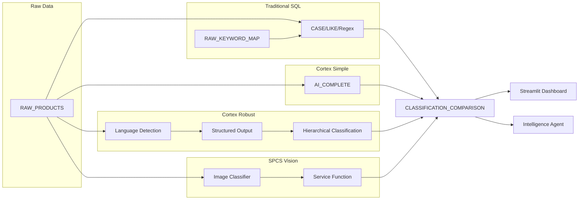

# Glaze & Classify

> **Warning:** This demo expires on 2026-03-20. After expiration, deployment will fail.

Product classification showdown: four progressively sophisticated approaches to classifying an international bakery catalog — from brittle SQL to production-ready Cortex AI pipelines and custom SPCS vision models.

**Author:** SE Community
**Created:** 2026-02-18 | **Expires:** 2026-03-20 | **Status:** ACTIVE

## First Time Here?

1. **Deploy** — Copy `deploy_all.sql` into Snowsight, click "Run All"
2. **Explore** — Open the Streamlit dashboard to compare classification methods side-by-side
3. **Ask** — Chat with the Intelligence agent about classification accuracy across markets
4. **Cleanup** — Run `teardown_all.sql` when done

## What Gets Built

| Object | Type | Purpose |
|--------|------|---------|
| `SNOWFLAKE_EXAMPLE.GLAZE_AND_CLASSIFY` | Schema | Project schema |
| `SFE_GLAZE_AND_CLASSIFY_WH` | Warehouse | XS compute |
| `RAW_PRODUCTS` | Table | International product catalog (6 markets, 5+ languages) |
| `RAW_CATEGORY_TAXONOMY` | Table | Gold-standard category hierarchy |
| `RAW_KEYWORD_MAP` | Table | Traditional keyword-to-category lookup |
| `STG_CLASSIFIED_TRADITIONAL` | Table | SQL-based classification results |
| `STG_CLASSIFIED_CORTEX_SIMPLE` | Table | Simple Cortex COMPLETE results |
| `STG_CLASSIFIED_CORTEX_ROBUST` | Table | Robust Cortex pipeline results |
| `STG_CLASSIFIED_VISION` | Table | SPCS image classifier results |
| `CLASSIFICATION_COMPARISON` | View | Side-by-side accuracy comparison |
| `SV_GLAZE_PRODUCTS` | Semantic View | Intelligence agent data layer |
| `GLAZE_CLASSIFIER_AGENT` | Agent | Conversational product analysis |
| `GLAZE_CLASSIFY_DASHBOARD` | Streamlit | Interactive comparison dashboard |
| `GLAZE_VISION_SERVICE` | SPCS Service | Custom image classification model |

## The Four Approaches

### 1. Traditional SQL (Baseline)
CASE/LIKE/regex with keyword lookup tables. Works for English, breaks on Japanese katakana, fails entirely on image-only products. Requires constant maintenance as the catalog grows.

### 2. Cortex COMPLETE — Simple
A single `AI_COMPLETE()` call with a classification prompt. ~10 lines of SQL. Handles multiple languages out of the box. Shows how fast you can get started with AI classification.

### 3. Cortex COMPLETE — Robust
Multi-step pipeline: language detection, structured JSON output via type literals, hierarchical classification (Category > Subcategory > Attributes), confidence scoring, batch processing with error handling. Production-ready pattern.

### 4. SPCS Custom Vision Model
Snowpark Container Services running a lightweight image classification model. Exposed as a SQL-callable service function. Shows "bring your own model" for specialized domains where general LLMs fall short.

## Architecture

## Estimated Demo Costs

| Component | Size | Est. Credits/Run | Notes |
|-----------|------|-----------------|-------|
| Warehouse | X-SMALL | ~0.5 | Sample data load + classification |
| Cortex AI_COMPLETE | — | ~1.0 | ~200 products x 2 approaches |
| SPCS Compute Pool | CPU_X64_XS | ~0.5 | Image classification service |
| Storage | — | Minimal | <1 MB sample data |
| **Total** | | **~2.0 credits** | Single deployment run |

**Edition Required:** Enterprise (for SPCS + Cortex)

## Documentation

- [Deployment Guide](docs/01-DEPLOYMENT.md)
- [Usage Guide](docs/02-USAGE.md)
- [Cleanup Guide](docs/03-CLEANUP.md)
